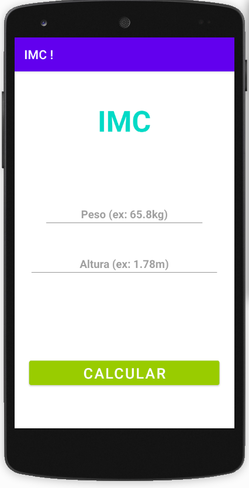
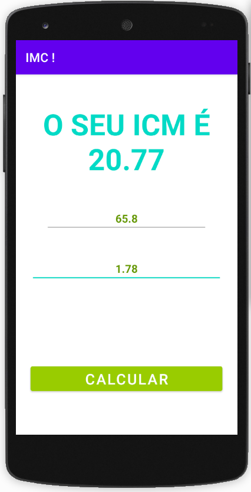

# Calculadora de IMC - Índice de Massa Corporal em Kotlin / Android Studio

## Descrição

O Aplicativo lê dois valores, peso e altura, para então processar o cálculo do IMC.

O cálculo do IMC é feito da mesma forma para todas as faixas etárias e utiliza o peso e a altura: divide-se o peso (em quilos) pela altura (em metros) ao quadrado.

IMC = Peso (quilos) 
Altura (metros) x altura (metros)

O que muda é a interpretação do resultado dessa conta.

Assim, um adulto de 1,75 m que pesa 67 kg tem IMC 21,88, considerado adequado. No entanto, para uma pessoa com mais de 60 anos de idade com os mesmos 1,75 m e 67 kg, esse IMC representa baixo peso.

Se esse adulto de 1,75 m chegar aos 82 kg (IMC de 26,78), será considerado com sobrepeso. Já o sênior de 1,75 m e 82 kg apresentará peso ideal.

A diferença se deve às modificações que acontecem no processo de envelhecimento, que podem estar relacionadas às doenças, ao estilo de vida e ao próprio avanço da idade, dizem as nutricionistas Ligiana Pires Corona, professora do curso de nutrição e do mestrado em gerontologia da Unicamp (Universidade Estadual de Campinas), e Larissa Hara, mestranda em ciências da nutrição e do esporte e metabolismo da mesma universidade.

